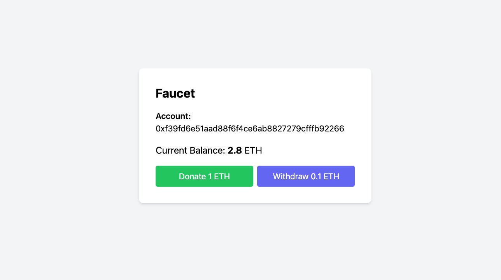

### Simple Bank App

1. `pnpm install`
2. `pnpm hardhat compile`
3. `pnpm hardhat node`
4. `pnpm hardhat run ./scripts/deploy.ts --network localhost`
5. `pnpm run frontend`
6. interact with MetaMask
7. **(Optional)**
  - Copy the generated contract address 
  - `pnpm hardhat run ./scripts/event-listener.ts`
  ```
  korges@macbook donation-vault-dapp % pnpm hardhat run ./scripts/event-listener.ts
  Listening for Vault events...
  Listening on events...
  Deposit | user: 0x70997970C51812dc3A010C7d01b50e0d17dc79C8 | amount: 0.1
  Deposit | user: 0xf39Fd6e51aad88F6F4ce6aB8827279cffFb92266 | amount: 0.2
  Withdraw | user: 0xf39Fd6e51aad88F6F4ce6aB8827279cffFb92266 | amount: 0.1
  Deposit | user: 0x70997970C51812dc3A010C7d01b50e0d17dc79C8 | amount: 0.1
  Withdraw | user: 0x70997970C51812dc3A010C7d01b50e0d17dc79C8 | amount: 0.1
  ```
  - `pnpm hardhat run ./scripts/get-all-user-balances.ts`
  ```
  === All User Balances ===
  1. User: 0xf39Fd6e51aad88F6F4ce6aB8827279cffFb92266, Balance: 2.2 ETH
  2. User: 0x70997970C51812dc3A010C7d01b50e0d17dc79C8, Balance: 1.0 ETH
  ```
  - `pnpm hardhat run ./scripts/get-balance-for-caller.ts`
  ```
  Balance for 0xf39Fd6e51aad88F6F4ce6aB8827279cffFb92266: 1.1 ETH
  ```
  

  